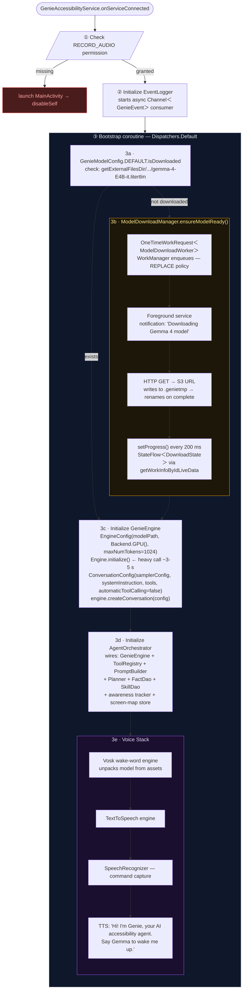
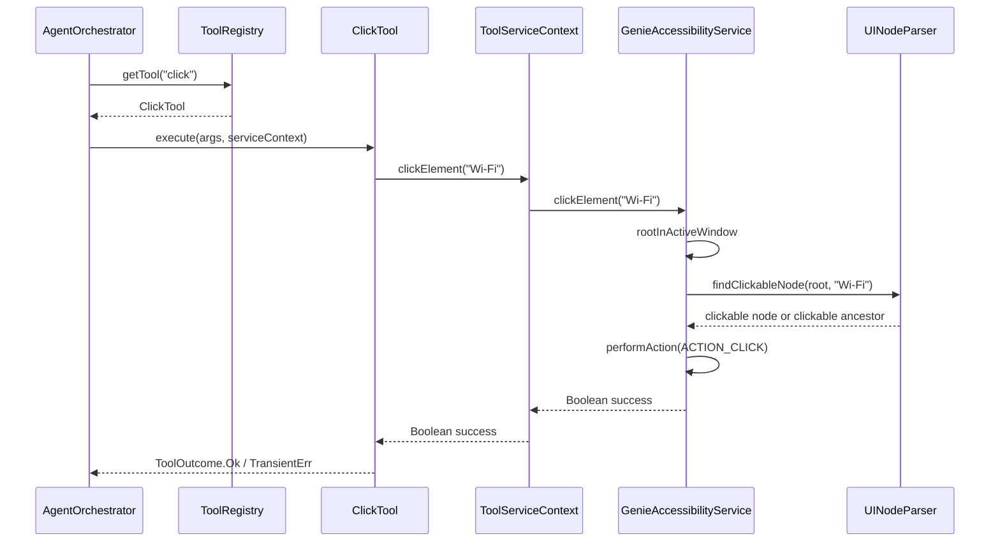
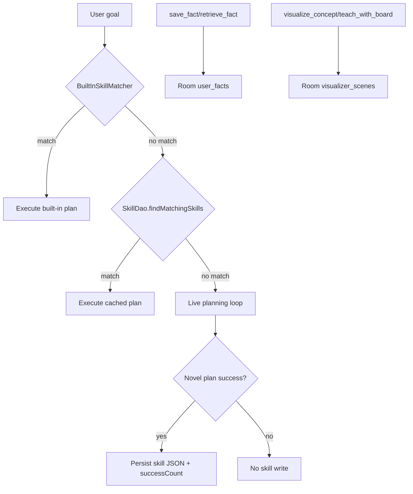
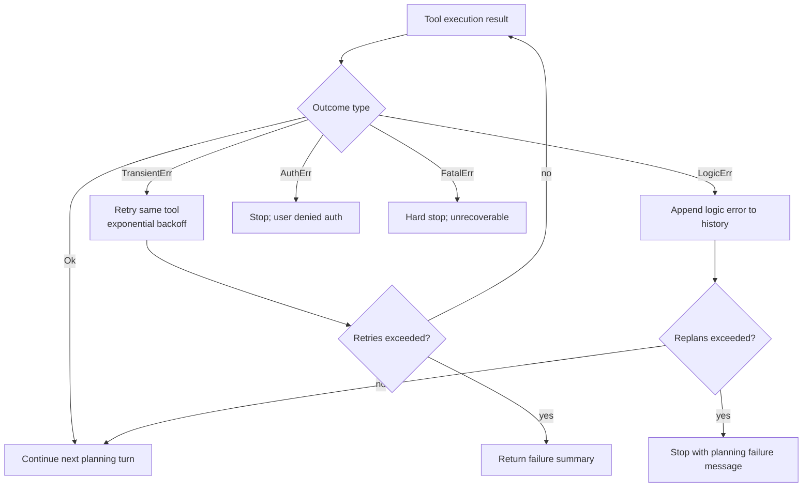
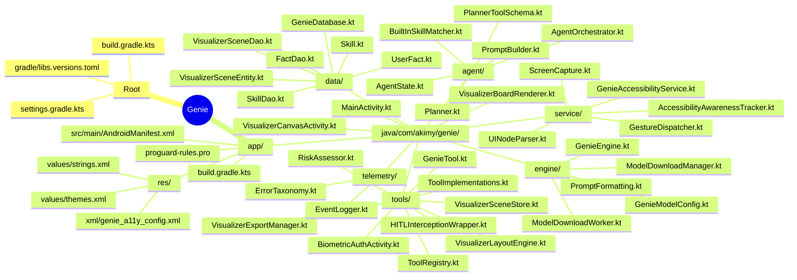
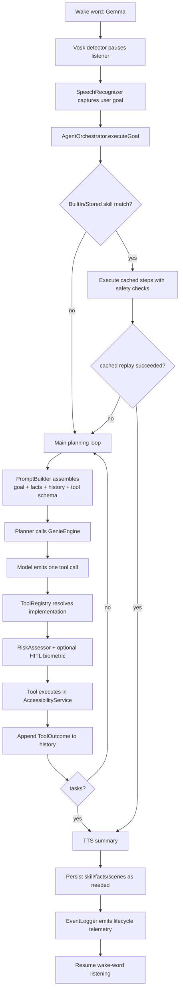

# 🧞 Genie — The Story of an Autonomous Android AI Agent

> *"What if your phone didn't just listen to you — what if it could think, plan, act, learn from its mistakes, and remember what you like?"*

Genie is not a chatbot. It is not a voice assistant. Genie is an **autonomous AI agent** that lives inside Android's Accessibility Service layer and can **see your screen, touch your apps, read your content, and execute multi-step tasks** — all powered by a Gemma 4 LiteRT-LM package running entirely on your device, with zero cloud dependency.

This document tells the full story of how Genie works, from the moment a user installs it to the moment it completes its hundredth task faster than its first.

---

## Table of Contents

- [🧞 Genie — The Story of an Autonomous Android AI Agent](#-genie--the-story-of-an-autonomous-android-ai-agent)
  - [Table of Contents](#table-of-contents)
  - [Chapter 1: The First Launch — Bootstrap](#chapter-1-the-first-launch--bootstrap)
    - [The Story](#the-story)
    - [What Happens Under the Hood](#what-happens-under-the-hood)
    - [The Key Files](#the-key-files)
    - [Where This Code Came From](#where-this-code-came-from)
  - [Chapter 2: The Wake Word — Listening for "Gemma"](#chapter-2-the-wake-word--listening-for-gemma)
    - [The Story](#the-story-1)
    - [What Happens Under the Hood](#what-happens-under-the-hood-1)
    - [Why Two Speech Engines?](#why-two-speech-engines)
  - [Chapter 3: The Brain Thinks — LiteRT-LM Inference](#chapter-3-the-brain-thinks--litert-lm-inference)
    - [The Story](#the-story-2)
    - [What Happens Under the Hood](#what-happens-under-the-hood-2)
    - [The Critical Configuration](#the-critical-configuration)
    - [Where This Code Came From](#where-this-code-came-from-1)
  - [Chapter 4: The Agent Loop — Planning Like a Human](#chapter-4-the-agent-loop--planning-like-a-human)
    - [The Story](#the-story-3)
    - [What Happens Under the Hood](#what-happens-under-the-hood-3)
    - [The Sliding Window](#the-sliding-window)
    - [The Prompt](#the-prompt)
    - [The Key Files](#the-key-files-1)
  - [Chapter 5: The Hands — Touching the OS](#chapter-5-the-hands--touching-the-os)
    - [The Story](#the-story-4)
    - [What Happens Under the Hood](#what-happens-under-the-hood-4)
    - [The Full Tool Arsenal](#the-full-tool-arsenal)
    - [The ToolServiceContext Pattern](#the-toolservicecontext-pattern)
    - [The Gesture System](#the-gesture-system)
    - [The Key Files](#the-key-files-2)
  - [Chapter 6: The Safety Net — Human-in-the-Loop](#chapter-6-the-safety-net--human-in-the-loop)
    - [The Story](#the-story-5)
    - [What Happens Under the Hood](#what-happens-under-the-hood-5)
    - [Why a Transparent Activity?](#why-a-transparent-activity)
    - [The Key Files](#the-key-files-3)
  - [Chapter 7: The Memory — Learning and Evolving](#chapter-7-the-memory--learning-and-evolving)
    - [The Story](#the-story-6)
    - [The Fact Store](#the-fact-store)
    - [Memory Flow](#memory-flow)
    - [The Key Files](#the-key-files-4)
  - [Chapter 8: When Things Go Wrong — Error Taxonomy](#chapter-8-when-things-go-wrong--error-taxonomy)
    - [The Story](#the-story-7)
    - [Failure Handling Loop](#failure-handling-loop)
    - [The Four Tiers](#the-four-tiers)
  - [Chapter 9: The Nervous System — Observability](#chapter-9-the-nervous-system--observability)
    - [The Story](#the-story-8)
    - [The Key Files](#the-key-files-5)
  - [Appendix: The Full File Map](#appendix-the-full-file-map)
  - [The End-to-End Flow (One Picture)](#the-end-to-end-flow-one-picture)

---

## Chapter 1: The First Launch — Bootstrap

### The Story

A user installs Genie for the first time. They open the app and see a minimal setup screen — not a chat interface, not a tutorial, just two things:

1. **A button** to enable the Accessibility Service
2. **A status card** showing what's been done

The app is configured for S3-only model delivery.

They tap "Enable Genie Accessibility Service" and are taken to Android's Accessibility Settings. They toggle Genie on. The moment they do, the **bootstrap sequence** fires.

### What Happens Under the Hood



### The Key Files

| File | Role |
|------|------|
| [`MainActivity.kt`](app/src/main/java/com/akimy/genie/MainActivity.kt) | One-time setup UI: permission grant and A11y enable |
| [`GenieModelConfig.kt`](app/src/main/java/com/akimy/genie/engine/GenieModelConfig.kt) | Model metadata: S3 URL, file name, size, local path computation |
| [`ModelDownloadWorker.kt`](app/src/main/java/com/akimy/genie/engine/ModelDownloadWorker.kt) | Background download with resume and foreground notification |
| [`ModelDownloadManager.kt`](app/src/main/java/com/akimy/genie/engine/ModelDownloadManager.kt) | WorkManager orchestration, `StateFlow<DownloadState>` emission |
| [`GenieAccessibilityService.kt`](app/src/main/java/com/akimy/genie/service/GenieAccessibilityService.kt) | The bootstrap entry point (`onServiceConnected()`) |

### Where This Code Came From

The download pipeline is adapted from Google's **AI Edge Gallery** app. We extracted the core HTTP streaming loop, resume behavior, progress reporting, and foreground service pattern, then stripped Firebase analytics, deep-link notifications, and zip extraction logic that Genie doesn't need.

---

## Chapter 2: The Wake Word — Listening for "Gemma"

### The Story

After bootstrap completes, Genie goes silent. No UI. No overlay. The phone looks completely normal. But a `Recognizer` from the **Vosk** offline speech recognition library is running in the background, listening to the microphone at 16kHz, waiting for one word: **"Gemma."**

The user is browsing their phone. They say: *"Gemma."*

Instantly:
1. Vosk detects "gemma" in its partial result hypothesis
2. Vosk stops listening (to free the microphone)
3. A processing overlay appears: *"🧞 Genie is thinking..."*
4. Android's built-in `SpeechRecognizer` takes over for the actual command
5. The user says: *"Open Settings and turn on Wi-Fi"*
6. STT captures the text, overlay disappears
7. The text is dispatched to the AgentOrchestrator

### What Happens Under the Hood

```kotlin
// Vosk RecognitionListener (in GenieAccessibilityService)
override fun onPartialResult(hypothesis: String?) {
    val json = JSONObject(hypothesis)
    val partial = json.optString("partial", "")
    if (partial.lowercase().contains("gemma")) {
        speechService?.stop()           // Kill Vosk
        showProcessingOverlay()          // Show "thinking" overlay
        startSttListening()              // Start Android STT
    }
}

// STT RecognitionListener callback
onResults { results ->
    val text = results.getStringArrayList(RESULTS_RECOGNITION)?.getOrNull(0) ?: ""
    dispatchToAgent(text)  // Route to agent orchestrator
}
```

### Why Two Speech Engines?

- **Vosk** runs continuously but is lightweight — it only needs to detect one word. It runs offline, uses ~30MB RAM, and has near-zero latency for wake-word detection.
- **Android SpeechRecognizer** is heavy but accurate — it handles full sentence recognition with proper grammar and punctuation. It only activates after the wake word.

This dual-engine pattern is part of Genie's voice architecture because it works reliably on mid-range Android devices while keeping wake-word detection lightweight.

---

## Chapter 3: The Brain Thinks — LiteRT-LM Inference

### The Story

The user said: *"Open Settings and turn on Wi-Fi."*

This text string arrives at `GenieEngine.sendAgentMessage()`. But GenieEngine doesn't just generate text — it streams tokens through a **Kotlin Flow**, converting LiteRT-LM's callback-based API into something the agent loop can consume asynchronously.

### What Happens Under the Hood

```kotlin
// Inside GenieEngine — the callback-to-Flow conversion
fun sendAgentMessage(text: String): Flow<AgentResponse> = callbackFlow {
    conversation.sendMessageAsync(
        Contents.of(Content.Text(text)),
        object : MessageCallback {
            override fun onMessage(message: Message) {
                // Native tool-calling: model may return toolCalls instead of plain text
                if (message.toolCalls.isNotEmpty()) {
                    trySend(AgentResponse.ToolCallRequest(message))
                } else {
                    trySend(AgentResponse.Token(message.toString()))
                }
            }
            override fun onDone() {
                trySend(AgentResponse.Done)
                close()
            }
            override fun onError(throwable: Throwable) {
                // CancellationException → TransientErr (can retry)
                // Everything else → FatalErr (must stop)
                trySend(AgentResponse.Error(classifyError(throwable)))
                close()
            }
        }
    )
    awaitClose { }
}
```

### The Critical Configuration

When the engine creates a conversation, it passes `automaticToolCalling = false`. This is the **single most important line of code in the entire project.**

In default mode, LiteRT-LM would see a tool schema, detect a tool call in the model's output, automatically execute it, and feed the result back — all without the application's knowledge. That's fine for a chatbot. It's catastrophic for an agent that can **tap buttons, type passwords, and open apps on your phone.**

By setting `automaticToolCalling = false`, every tool call request from the model is intercepted by our code. We see it, we validate it, we optionally ask for biometric approval, and only then do we execute it and feed the result back. This is the foundation of the Human-in-the-Loop safety system.

### Where This Code Came From

The `EngineConfig` → `Engine` → `engine.initialize()` → `engine.createConversation(ConversationConfig)` → `conversation.sendMessageAsync(contents, MessageCallback)` pattern is a near-verbatim extraction from Gallery's `LlmChatModelHelper.kt`. The `SamplerConfig(topK, topP, temperature)` configuration, the `Backend.GPU()` selection, the cleanup sequence (`conversation.close()` then `engine.close()`) — all of this was proven working in Gallery and transplanted into Genie.

---

## Chapter 4: The Agent Loop — Planning Like a Human

### The Story

Here is where Genie diverges from every chatbot and voice assistant on Android. The user said *"Open Settings and turn on Wi-Fi"* — this is a **multi-step task.** A chatbot would try to answer in one shot. Genie **plans.**

The `AgentOrchestrator` runs a loop that mimics how a human would approach the task:

1. **Think:** "What's my goal? Open Settings and turn on Wi-Fi."
2. **Look:** "I don't know what's on screen. Let me read it."
3. **Act:** "I see the home screen. Let me open Settings."
4. **Look again:** "I'm in Settings now. Let me find Wi-Fi."
5. **Act:** "I see 'Network & internet'. Let me click it."
6. **Act:** "I see 'Wi-Fi' toggle. Let me click it."
7. **Evaluate:** "Wi-Fi is now ON. Goal complete."

Each iteration of this loop is one call to the LLM planner.

### What Happens Under the Hood

```mermaid
flowchart TD
    A([AgentOrchestrator.executeGoal]) --> B[Initialize AgentState\nadd UserMessage to history]
    B --> C{findSkillMatch(goal)}

    C -->|BuiltIn or Stored skill| D[executeCachedPlan\nstep through cached Decision.Act list]
    D --> D1{all steps succeeded?}
    D1 -->|yes| Z[tasks plan\nresume wake-word listening]
    D1 -->|no| E

    C -->|no match| E

    subgraph LOOP [Main loop max 20]
        direction TD
        E[Build prompt\nGoal + injected facts + sliding window history] --> F[Planner.plan(prompt)\nvia GenieEngine]
        F --> G{PlanResult}
        G -->|Decision.Act| H[executeToolWithSafety]
        G -->|Decision.Finish| Z
        G -->|ParseError| E

        H --> I{RiskAssessor verdict}
        I -->|Allow| J[ToolRegistry execute]
        I -->|RequireBiometric| K[HITLInterceptionWrapper\nBiometricAuthActivity]
        K --> J

        J --> L[handleSpecialTools\nFacts, PDF, visualizer, board]
        L --> M{ToolOutcome}
        M -->|Ok| E
        M -->|TransientErr| N[retry with exponential backoff]
        N --> E
        M -->|LogicErr| O[replan and continue]
        O --> E
        M -->|AuthErr or FatalErr| P[stop and notify user]
    end
```

### The Sliding Window

The agent's history grows with every step. But the LLM has a limited context window (1024 tokens). The `SlidingWindowManager` solves this:

- Keeps the **first entry** (the user's goal — always visible)
- Keeps the **last 9 entries** (recent actions and results)
- When a tool succeeds, it **prunes** any preceding `TransientErr` entries for that same tool — they're noise that wastes context tokens

This means the LLM always sees the goal and the most recent context, even during long multi-step tasks.

### The Prompt

The system prompt in `PromptBuilder.AGENT_SYSTEM_PROMPT` forces the model to emit **exactly one native LiteRT-LM tool call per turn**. Plain text during planning is treated as invalid. Goal completion is represented as a `tasks(plan=...)` tool call, which the planner maps into `Decision.Finish`.

The prompt also injects explicit behavior rules for accessibility-aware exploration tools, continuous-reader tools, screen-map memory tools, visualizer/teaching-board tools,.

### The Key Files

| File | Role |
|------|------|
| [`AgentOrchestrator.kt`](app/src/main/java/com/akimy/genie/agent/AgentOrchestrator.kt) | The main loop: prompt→plan→execute→evaluate→repeat |
| [`AgentState.kt`](app/src/main/java/com/akimy/genie/agent/AgentState.kt) | `Decision.Act`, `Decision.Finish`, `HistoryEntry`, `ToolOutcome` |
| [`SlidingWindowManager.kt`](app/src/main/java/com/akimy/genie/agent/SlidingWindowManager.kt) | Context window truncation + error pruning |
| [`PromptBuilder.kt`](app/src/main/java/com/akimy/genie/agent/PromptBuilder.kt) | System prompt + history assembly |
| [`Planner.kt`](app/src/main/java/com/akimy/genie/agent/Planner.kt) | Skill cache check → LLM call → native tool-call parsing |
| [`PlannerToolSchema.kt`](app/src/main/java/com/akimy/genie/agent/PlannerToolSchema.kt) | LiteRT-LM tool schema exposed to planner |
| [`BuiltInSkillMatcher.kt`](app/src/main/java/com/akimy/genie/agent/BuiltInSkillMatcher.kt) | Deterministic built-in skills before DB skill lookup |

---

## Chapter 5: The Hands — Touching the OS

### The Story

When the Planner decides to act, the agent needs hands. These hands are the **53 tools** registered in the `ToolRegistry`, each backed by Android's Accessibility APIs and grouped into action, awareness, memory, visualizer, and visualizer families.

Let's trace what happens when the planner emits a `click(target="Wi-Fi")` tool call:

### What Happens Under the Hood



### The Full Tool Arsenal

| Family | Representative Tools | What It Does |
|------|-------------|-----------|
| Core OS Actions | `click`, `type_text`, `swipe`, `scroll`, `open_app`, `go_back`, `go_home`, `take_screenshot` | Directly interacts with Android UI and global navigation |
| Focus Navigation | `read_focused`, `focus_next`, `focus_previous`, `focus_first`, `focus_by_text`, `focus_by_role`, `activate_focused`, `scroll_forward`, `scroll_backward` | Uses accessibility focus semantics instead of blind touch guesswork |
| Awareness and Context | `read_screen_summary`, `read_recent_events`, `where_am_i`, `read_nearby_context`, `what_can_i_do_here`, `read_screen_changes`, `read_dialog`, `read_notifications`, `read_form_state` | Gives the planner high-quality situational awareness before acting |
| Continuous Reader | `enable_continuous_reader`, `disable_continuous_reader`, `read_continuous_reader_status`, `repeat_last_narration` | Spoken ambient guidance and status control |
| Screen Memory | `read_screen_map`, `save_screen_hint` | Learns landmarks and user hints per recurring screen |
| Persistent Memory | `save_fact`, `retrieve_fact` | Long-term preference storage in Room |
| Document I/O | `read_pdf_page_range` | Reads local PDF text page ranges for grounded tasks |
| Visualizer and Teaching Board | `visualize_concept`, `teach_with_board`, `board_add_object`, `board_update_object`, `board_remove_object`, `board_focus_object`, `board_reveal_step`, `board_next_step`, `board_prev_step`, `board_replay_step`, `board_set_narration` | Builds and teaches concepts with visual scenes and staged board lessons |

### The ToolServiceContext Pattern

Tools don't touch the `AccessibilityService` directly. They go through the `ToolServiceContext` interface:

```kotlin
interface ToolServiceContext {
    suspend fun clickElement(target: String): Boolean
    suspend fun typeText(text: String): Boolean
    suspend fun swipe(direction: String): Boolean
    ...
}
```

`GenieAccessibilityService` implements this interface. This means during unit tests, you can inject a **mock** `ToolServiceContext` that simulates all OS actions without needing a real device.

### The Gesture System

Genie uses a consolidated gesture layer in `GestureDispatcher` with a single `swipe(Direction)` method, plus `tap(x, y)` and `longPress(x, y, duration)` for more flexible UI automation.

Every gesture method is a **suspend function** that wraps `AccessibilityService.dispatchGesture()` callback into a coroutine using `suspendCancellableCoroutine`. This means the agent loop can `await` a gesture completing before moving to the next step.

### The Key Files

| File | Role |
|------|------|
| [`ToolRegistry.kt`](app/src/main/java/com/akimy/genie/tools/ToolRegistry.kt) | Central name→tool map, validates existence |
| [`GenieTool.kt`](app/src/main/java/com/akimy/genie/tools/GenieTool.kt) | Tool interface + `ToolServiceContext` abstraction |
| [`ToolImplementations.kt`](app/src/main/java/com/akimy/genie/tools/impl/ToolImplementations.kt) | All runtime tool implementations |
| [`UINodeParser.kt`](app/src/main/java/com/akimy/genie/service/UINodeParser.kt) | BFS tree traversal, text extraction, node finding |
| [`GestureDispatcher.kt`](app/src/main/java/com/akimy/genie/service/GestureDispatcher.kt) | Swipe/tap/scroll as suspend functions |
| [`ScreenCapture.kt`](app/src/main/java/com/akimy/genie/service/ScreenCapture.kt) | `takeScreenshot()` → `Bitmap` coroutine wrapper |
| [`AccessibilityAwarenessTracker.kt`](app/src/main/java/com/akimy/genie/service/AccessibilityAwarenessTracker.kt) | Event-aware screen semantics and change tracking |
| [`ScreenMapStore.kt`](app/src/main/java/com/akimy/genie/service/ScreenMapStore.kt) | Persistent screen landmarks and user hints |
| [`VisualizerLayoutEngine.kt`](app/src/main/java/com/akimy/genie/tools/VisualizerLayoutEngine.kt) | Deterministic layout generation for visualizer scenes |
| [`VisualizerExportManager.kt`](app/src/main/java/com/akimy/genie/tools/VisualizerExportManager.kt) | PNG export/share pipeline for generated teaching visuals |

---

## Chapter 6: The Safety Net — Human-in-the-Loop

### The Story

The user says: *"Gemma, send $50 to John via PayPal."*

This is a **dangerous action.** Genie should not blindly click "Send" on a payment screen. This is where the **dynamic Human-in-the-Loop (HITL) Safety Wrapper** activates.

Unlike static per-tool auth flags, Genie evaluates the current screen context in real time via `RiskAssessor`.

For sensitive actions (currently `click` and `type_text`), it computes a risk score from multiple signals such as:
- payment and transfer keywords,
- authentication/account setting terms,
- destructive action words,
- package heuristics,
- focused-field semantics.

When two or more medium/high-confidence signals are present, the wrapper requires biometric confirmation before execution.

### What Happens Under the Hood

```mermaid
flowchart TD
    A[Decision.Act from planner] --> B[AgentOrchestrator.executeToolWithSafety]
    B --> C[collect ScreenContextSnapshot\nfocused text, visible text, package, action]
    C --> D[RiskAssessor.assess(toolName, args, context)]
    D --> E{RiskVerdict}
    E -->|Allow| F[Execute tool directly]
    E -->|RequireBiometric| G[HITLInterceptionWrapper.authenticateAndExecute]
    G --> H[Launch BiometricAuthActivity]
    H --> I[BiometricPrompt result]
    I --> J{Approved?}
    J -->|yes| F
    J -->|no| K[ToolOutcome.AuthErr]
```

### Why a Transparent Activity?

`BiometricPrompt` requires a `FragmentActivity` context. An `AccessibilityService` doesn't have one. The workaround is an activity that:
- Has no visible UI (`Theme.Translucent.NoTitleBar`)
- Is excluded from recents (`excludeFromRecents="true"`)
- Has its own task affinity (`taskAffinity=""`) to not interfere with the user's app stack
- Immediately `finish()`es after sending the auth result

The user sees the fingerprint overlay appear, authenticates, and the overlay vanishes. They never see or interact with the activity itself.

### The Key Files

| File | Role |
|------|------|
| [`RiskAssessor.kt`](app/src/main/java/com/akimy/genie/tools/RiskAssessor.kt) | Dynamic on-screen risk scoring for sensitive actions |
| [`HITLInterceptionWrapper.kt`](app/src/main/java/com/akimy/genie/tools/HITLInterceptionWrapper.kt) | Intercepts auth-required tools, launches biometric activity, waits for result |
| [`BiometricAuthActivity.kt`](app/src/main/java/com/akimy/genie/tools/BiometricAuthActivity.kt) | Transparent activity that triggers `BiometricPrompt` |

---

## Chapter 7: The Memory — Learning and Evolving

### The Story

Genie just completed "Open Settings and turn on Wi-Fi" for the first time. It took multiple steps and several model turns. The `AgentOrchestrator` marks this as a **novel plan** and decides to **remember it** in persistent storage.

At execution time, memory retrieval follows this order:
1. deterministic built-in skill matching,
2. Room-backed skill matching,
3. live planning if no reusable plan exists.

When a novel plan succeeds, Genie serializes the reusable `Decision.Act` sequence and writes it to the `skills` table:

```json
{
    "goalPattern": "open settings and turn on wi-fi",
    "planJson": "[{\"tool\":\"open_app\",\"args\":{\"name\":\"Settings\"}},{\"tool\":\"click\",\"args\":{\"target\":\"Network & internet\"}},{\"tool\":\"click\",\"args\":{\"target\":\"Wi-Fi\"}}]",
    "successCount": 1
}
```

Two days later, the user says: *"Gemma, turn on Wi-Fi."*

The planner checks built-in skills and SkillLibrary first:

```kotlin
val skills = skillDao.findMatchingSkills("turn on wi-fi")
// SQL: SELECT * FROM skills WHERE goalPattern LIKE '%turn on wi-fi%'
```

If it finds a match, Genie **replays the cached plan** step-by-step with safety checks. If a cached step fails (for example, UI drift), it falls back to live planning.

Every time a cached skill succeeds, its `successCount` is incremented. Skills with better reliability are prioritized over time. This is local, on-device self-improvement.

### The Fact Store

Beyond skills, Genie also has a persistent key-value store for user facts:

- The user says: *"Remember that my favorite restaurant is Mama Cass"*
- Agent calls `save_fact(key="favorite_restaurant", value="Mama Cass")`
- This is stored in the Room `user_facts` table with timestamps
- Later: *"What's my favorite restaurant?"*
- Agent calls `retrieve_fact(key="favorite_restaurant")` → "Mama Cass"
- Facts are also injected into every prompt via `PromptBuilder`, so the LLM always knows the user's preferences

Genie also persists visual teaching scenes used by visualizer and board tools, so educational state can be replayed and edited across turns.

### Memory Flow



### The Key Files

| File | Role |
|------|------|
| [`BuiltInSkillMatcher.kt`](app/src/main/java/com/akimy/genie/agent/BuiltInSkillMatcher.kt) | Deterministic fast-path skill matching |
| [`Skill.kt`](app/src/main/java/com/akimy/genie/data/Skill.kt) | Room entity: `goalPattern`, `planJson`, `successCount` |
| [`SkillDao.kt`](app/src/main/java/com/akimy/genie/data/SkillDao.kt) | Find matching skills, increment success count |
| [`UserFact.kt`](app/src/main/java/com/akimy/genie/data/UserFact.kt) | Room entity: `key`, `value`, timestamps |
| [`FactDao.kt`](app/src/main/java/com/akimy/genie/data/FactDao.kt) | CRUD + upsert for user facts |
| [`VisualizerSceneEntity.kt`](app/src/main/java/com/akimy/genie/data/VisualizerSceneEntity.kt) | Room entity for persisted visual teaching scenes |
| [`VisualizerSceneDao.kt`](app/src/main/java/com/akimy/genie/data/VisualizerSceneDao.kt) | Scene upsert/query/delete operations |
| [`GenieDatabase.kt`](app/src/main/java/com/akimy/genie/data/GenieDatabase.kt) | Room singleton housing both tables |

---

## Chapter 8: When Things Go Wrong — Error Taxonomy

### The Story

The planner emits `click(target="Wi-Fi")`, but Settings has not fully rendered yet. `UINodeParser.findClickableNode()` returns null. The click tool returns `ToolOutcome.TransientErr("Could not find clickable element: 'Wi-Fi'")`.

The orchestrator classifies this and retries with exponential backoff.

Now imagine a different failure: the model requests a non-existent tool call like `send_money(...)`. `ToolRegistry` returns `ToolOutcome.LogicErr("Unknown tool 'send_money'")`.

That error is appended to history so the model can self-correct on the next planning turn.

### Failure Handling Loop



### The Four Tiers

| Tier | Meaning | Recovery | Example |
|------|---------|----------|---------|
| `TransientErr` | Might work if we wait | Retry with exponential backoff | UI loading, network lag |
| `LogicErr` | Agent made a bad choice | Replan (model sees error in history) | Invalid tool name, wrong args |
| `AuthErr` | User denied authorization | Stop with notification | Biometric denied, HITL timeout |
| `FatalErr` | Unrecoverable | Hard stop immediately | OOM, engine crash, JNI error |

---

## Chapter 9: The Nervous System — Observability

### The Story

Every significant event in Genie's lifecycle flows through the `EventLogger` — an asynchronous event bus backed by a Kotlin `Channel`. Events are emitted with `trySend()` (non-blocking, never delays the agent loop) and consumed by a dedicated coroutine that writes to Logcat:

```
I/GenieEventLogger: 📦 Bootstrap: engine_init [3421ms]
I/GenieEventLogger: ⚡ State: idle → planning
I/GenieEventLogger: 🧠 Inference: 847ms, 156 tokens
I/GenieEventLogger: ✅ Tool: open_app({name=Settings}) [234ms]
I/GenieEventLogger: 🧠 Inference: 612ms, 89 tokens
I/GenieEventLogger: ✅ Tool: click({target=Network & internet}) [187ms]
I/GenieEventLogger: ✅ Tool: click({target=Wi-Fi}) [143ms]
I/GenieEventLogger: ⚡ State: executing → finished
I/GenieEventLogger: 📚 Skill written: 'open settings and turn on wi-fi' (3 steps)
```

This is the first thing you'd look at when debugging. Every state transition, every tool execution with its latency, every error with its classification, every skill write — all timestamped and categorized.

### The Key Files

| File | Role |
|------|------|
| [`EventLogger.kt`](app/src/main/java/com/akimy/genie/telemetry/EventLogger.kt) | `Channel<GenieEvent>` event bus, Logcat consumer |
| [`ErrorTaxonomy.kt`](app/src/main/java/com/akimy/genie/telemetry/ErrorTaxonomy.kt) | `TransientErr`, `LogicErr`, `AuthErr`, `FatalErr` |

---

## Appendix: The Full File Map



---

## The End-to-End Flow (One Picture)



That's Genie. An agent that listens, thinks, acts, learns, and protects — all running locally on your phone.
